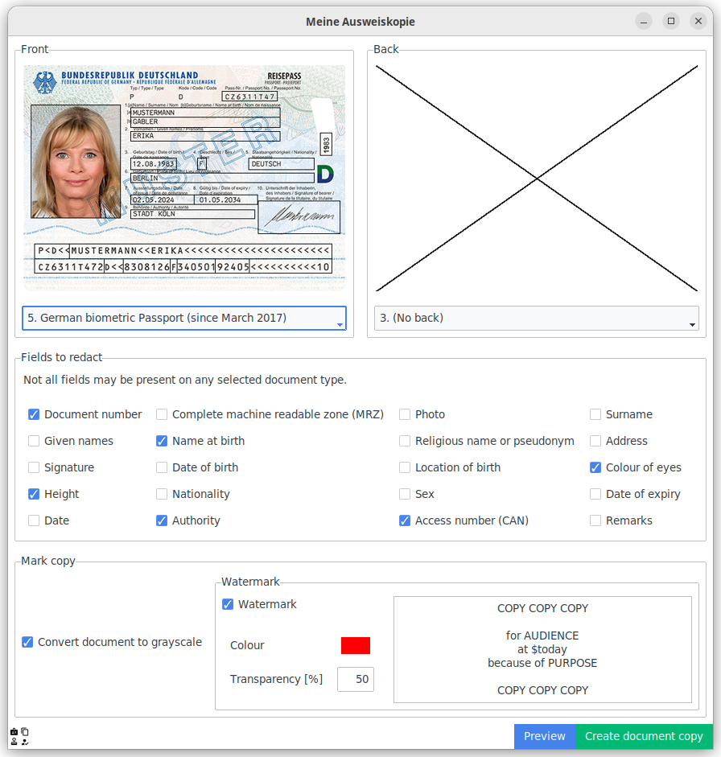
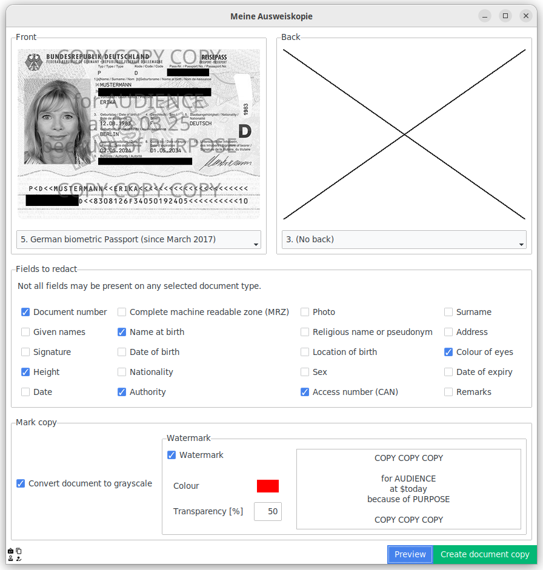
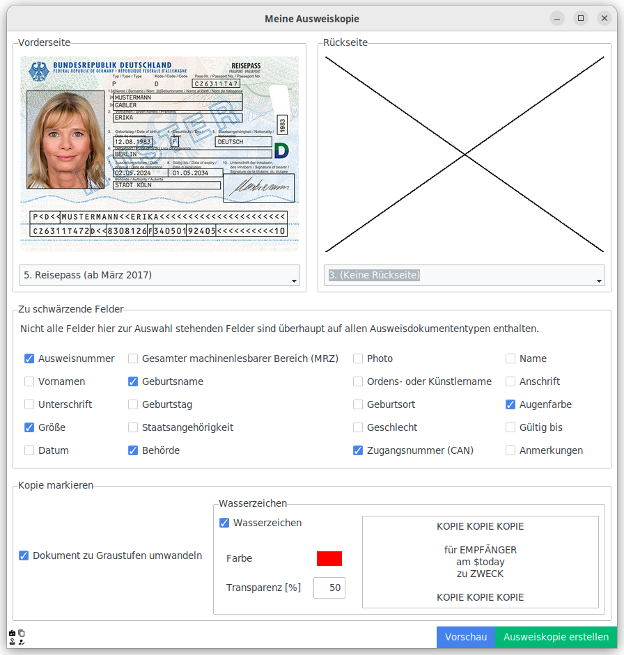

# My identity card copy

> Easily watermark and hide information in copies of your (german) identity card!<br>
> 🇩🇪 [German language information is below.](#meine-ausweiskopie)

| Before                                                                                                                                                     | After                                                                                                                                                            |
|------------------------------------------------------------------------------------------------------------------------------------------------------------|------------------------------------------------------------------------------------------------------------------------------------------------------------------|
|  |  |

This tool allows watermarking copies of german identity documents.
You can also blacken information your recipient does not need (like the document number or CAN).

Currently, this tool supports the following identity documents:
- German identity cards (Personalausweis):
  - Current version with EU and biometric icon (issued since the 2nd August 2021)
  - Previous version with a dedicated field for the name at birth (issued from 19th December 2019 to 1st August 2021)
  - Previous version without a dedicated field for the name at birth (issued until 19th December 2019)
- Temporary German identity cards (Vorläufiger Personalausweis) issued on paper
- Regular biometric German passports 

## Installation

Other installation methods are currently evaluated!

### From PyPI

Install with pip:

```pip install ausweiskopie```

You can now run it with `python -m ausweiskopie`.
Your Python installation must have the `tkinter`. 

Optional features:
 - **Modern theme**: This application will make use of _ttkbootstrap_ if available. Just run `pip install ausweiskopie[modern]`
 - **XDG Desktop Portals** (native file open/save-as dialogs on Linux): If your desktop manager provides XDG portals, just install `pip install ausweiskopie[portals]`.
 - **Drag-and-Drop**: If your Tk/Tcl environment has the `tkdnd` extension, Drag-and-drop support is automatically enabled.

# Meine Ausweiskopie

> Ausweiskopien schwärzen und einfach kenntlich machen.


| Vorher                                                                                                                                    | Nacher                                                                                                                                                   |
|-------------------------------------------------------------------------------------------------------------------------------------------|----------------------------------------------------------------------------------------------------------------------------------------------------------|
|  |  |

Nach [§&nbsp;20 PAuswG](https://www.gesetze-im-internet.de/pauswg/__20.html) gilt:

> (2) Der Ausweis darf nur vom Ausweisinhaber oder von anderen Personen mit Zustimmung des Ausweisinhabers in der Weise abgelichtet werden, dass die Ablichtung **eindeutig** und **dauerhaft als Kopie erkennbar** ist. Andere Personen als der Ausweisinhaber dürfen die Kopie nicht an Dritte weitergeben.

Dieses Werkzeug ermöglicht es eine Ausweiskopie als Kopie und eindeutigem Wasserzeichen zu kennzeichnen.
Für den Adressaten unwichtige Daten (z.&nbsp;B. die CAN oder die Ausweisnummer) können geschwärzt werden.

Folgende Ausweistypen werden unterstützt:
 - Vorläufiger Personalausweis
 - Neuer Personalausweis:
   - Aktuelle Fassung ab 2. August 2021 (mit EU-Logo und Biometriesymbol auf der Vorderseite)
   - Neuer Personalausweis mit gekennzeichnetem Geburtsnamen (ausgestellt vom 19. Dezember 2019 bis 1. August 2021)
   - Neuer Personalausweis (ursprüngliche Fassung)
 - Deutscher Reisepass (in Fassung ab 2017)

## Installation

Andere Installationsmöglichkeiten sind noch in Planung …

### Von PyPI

```
pip install ausweiskopie
```

Deine Python-Installation muss `tkinter` installiert haben.

Optionale-Features:
 - **Modernes Look and Feel**: Mittels *ttkbootstrap* kann der Anwendung ein modernes Aussehen übergestülpt werden, zur Installation `pip install ausweiskopie[modern]` ausführen.
 - **XDK Desktop Portals** (Natives Datei-Öffenen-/Speichern-Unter unter Linux): Die meisten Desktop-Umgebungen stellen diese mittlerweile bereit. Zur Installation `pip install ausweiskopie[portals]` durchführen.
 - **Drag-and-Drop**: Wenn `tkdnd` in deiner Tk/Tcl-Installation vorhanden ist, funktioniert Drag-und-Drop von Bilder.
